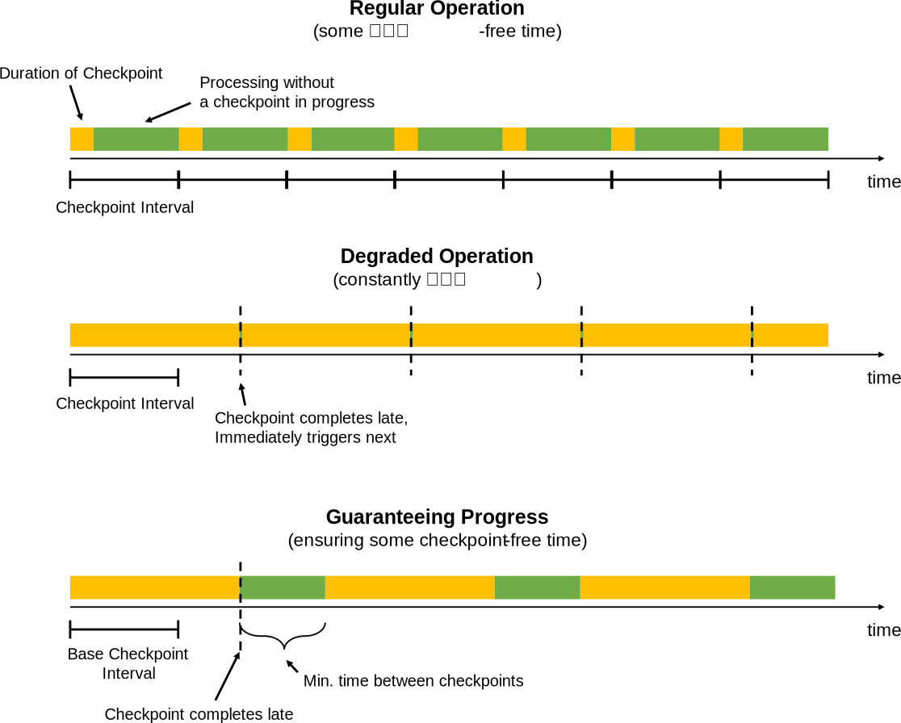

<!--
Licensed to the Apache Software Foundation (ASF) under one
or more contributor license agreements.  See the NOTICE file
distributed with this work for additional information
regarding copyright ownership.  The ASF licenses this file
to you under the Apache License, Version 2.0 (the
"License"); you may not use this file except in compliance
with the License.  You may obtain a copy of the License at

  http://www.apache.org/licenses/LICENSE-2.0

Unless required by applicable law or agreed to in writing,
software distributed under the License is distributed on an
"AS IS" BASIS, WITHOUT WARRANTIES OR CONDITIONS OF ANY
KIND, either express or implied.  See the License for the
specific language governing permissions and limitations
under the License.
-->

该页面提供了如何配置和优化使用大状态的应用程序的指南。

* ToC
{:toc}

## 概览

要使Flink应用程序在大规模可靠地运行，必须满足两个条件:
 - 应用程序需要能够可靠地获取检查点
 - 在发生故障后，资源需要足以赶上输入数据流

第一部分讨论如何在规模上获得性能良好的检查点。
最后一节解释了一些关于规划使用多少资源的最佳实践

## 监控状态和检查点

监视检查点行为的最简单方法是通过UI的检查点部分。 [checkpoint monitoring](../../monitoring/checkpoint_monitoring.html)的文档显示了如何访问可用的检查点指标。

The two numbers that are of particular interest when scaling up checkpoints are:

在扩大检查点时，特别值得注意的两个数字是:

  - Operator运算符启动检查点之前的时间：此时间目前尚未直接暴露，但对应于：
  `checkpoint_start_delay = end_to_end_duration - synchronous_duration - asynchronous_duration`当触发检查点的时间持续很长时，这意味着*检查点障碍 checkpoint barriers* 需要很长一段时间从source到operator运算符。这通常表明系统在恒定的背压(反压力)下运行。

 
  - (这里先保留)The amount of data buffered during alignments. For exactly-once semantics, Flink *aligns* the streams at
    operators that receive multiple input streams, buffering some data for that alignment.
    The buffered data volume is ideally low - higher amounts means that checkpoint barriers are received at
    very different times from the different input streams.

在对齐期间缓冲的数据量。对于exactly-once的语义，Flink *在接收多个输入流的运算符处*对齐*流，为该对齐缓冲一些数据。缓冲的数据量理想情况下是低的—高的数量意味着检查点屏障在非常不同的时间从不同的输入流接收。

请注意，当存在瞬态背压，数据倾斜或网络问题时，此处指示的数字偶尔会很高。 但是，如果数字一直很高，则意味着Flink将许多资源投入到检查点中。

## 调优检查点

检查点按应用程序可以的配置定期触发。 检查点的完成时间超过检查点间隔时，在进行中的检查点完成之前不会触发下一个检查点。 默认情况下，一旦正在进行的检查点完成，将立即触发下一个检查点(译者注:即下一个检查点将在当前检查点完成后立即触发)。

当检查点经常花费比基本间隔更长的时间时（例如，由于状态增长大于计划的，或者存储检查点的存储暂时变慢），系统会不断地使用检查点（一旦完成，就会立即启动新的检查点）。这可能意味着太多的资源总是被检查点占用，Operator运算符处理进展太少。此行为对使用异步检查点状态的流式应用程序的影响较小，但仍可能对整个应用程序性能产生影响。

为了防止这种情况，应用程序可以在检查点之间定义*检查点最小持续时间*：`StreamExecutionEnvironment.getCheckpointConfig().setMinPauseBetweenCheckpoints(milliseconds)`。 此持续时间是在最新检查点结束和下一个检查点开始之间必须经过的最小时间间隔。 下图说明了这是如何影响检查点的。

*注意:* 可以配置应用程序（通过`CheckpointConfig`）以允许多个检查点同时进行。 对于Flink中具有大状态的应用程序，这通常会将太多资源绑定到检查点。
当手动触发保存点时，它可能正在与正在进行的检查点同时进行。

## 调优网络Buffer缓冲区

在Flink 1.3之前，网络缓冲区的增加也导致了检查点时间的增加，因为保留更多的动态数据意味着检查点屏障被延迟。在Flink 1.3开始，每个传出/传入通道使用的网络缓冲区数量是有限的，因此可以在不影响检查点时间的情况下配置网络缓冲区（请参阅[网络缓冲区配置](../config.html#configuring-the-network-buffers)）。

## 尽可能使状态检查点异步化

当状态为*异步*快照时，检查点的伸缩性比状态为*同步*快照时要好。
尤其是在具有多个连接、协同功能或窗口的更复杂的流式应用程序中，这可能会产生深远的影响

要异步创建状态，应用程序必须做两件事：

  1. 使用[由Flink管理]的状态(../../dev/stream/state/state.html)：
  托管状态表示Flink提供存储state状态的数据结构。目前，这对于*keyed state 键控状态*来说是如此的，它是在`ValueState`，`ListState`，`ReducingState`等接口后面抽象出来的......

  2. 使用支持异步快照的状态后端。 在Flink1.2中，只有RocksDB状态后端使用完全异步快照。从Flink1.3开始，基于堆的状态后端也支持异步快照。

上述两点表明，大状态一般应保持为键控keyed state状态，而不是operator state状态。

## 调优RocksDB

许多大型Flink流应用程序的状态存储工作负载(存储主力)是*RocksDB状态后端*。
后端的规模远远超出了主内存，并可靠地存储大型 [keyed state](../../dev/stream/state/state.html)。

不幸的是，RocksDB的性能可能随配置的不同而变化，而且关于如何正确调优rocksdb的文档很少。 例如，默认配置是针对SSD定制的，并且在旋转磁盘上执行不理想。

**增量检查点**

与完整检查点相比，增量检查点可以显着缩短检查点时间，但代价是(可能)更长的恢复时间。 其核心思想是增量检查点仅记录对先前完成的检查点的所有更改，而不是生成状态后端的完整的自包含备份。 像这样，增量检查点建立在先前的检查点之上。 Flink以一种随时间自我整合的方式利用RocksDB的内部备份机制。 因此，Flink中的增量检查点历史记录不会无限增长，旧检查点最终会被包含并自动修剪。

虽然我们强烈建议对大型状态使用增量检查点，但请注意，这是一个新功能，目前默认情况下未启用。要启用此功能，用户可以实例化`RocksDBStateBackend`，并将构造函数中相应的布尔标记设置为`true`，例如：


    RocksDBStateBackend backend =
        new RocksDBStateBackend(filebackend, true);


**RocksDB计时器 timers**

对于RocksDB，用户可以选择计时器是存储在堆上（默认）还是存储在RocksDB中。对于数量较少的定时器timer，基于堆的timer具有更好的性能，而将计时器存储在RocksDB中可以提供更高的可伸缩性，因为RocksDB的定时器数量可能超过可用的主内存（溢出到磁盘）。

当使用RockDB作为状态后端时，可以通过Flink的配置选项`state.backend.rocksdb.timer-service.factory`键选择定时器存储的类型。
可能的选择是`heap`（在堆上存储定时器，默认）和`rocksdb`（在RocksDB中存储定时器）。

注意 *RocksDB状态后端/增量检查点和基于堆的定时器的组合当前不支持定时器状态的异步快照。
其他状态(如键控状态)仍然是异步快照的。 请注意，这不是以前版本的回归，将通过`FLINK-10026`解决*

**RocksDB 向RocksDB传递选项**


RocksDBStateBackend.setOptions(new MyOptions());

public class MyOptions implements OptionsFactory {

    @Override
    public DBOptions createDBOptions() {
        return new DBOptions()
            .setIncreaseParallelism(4)
            .setUseFsync(false)
            .setDisableDataSync(true);
    }

    @Override
    public ColumnFamilyOptions createColumnOptions() {

        return new ColumnFamilyOptions()
            .setTableFormatConfig(
                new BlockBasedTableConfig()
                    .setBlockCacheSize(256 * 1024 * 1024)  // 256 MB
                    .setBlockSize(128 * 1024));            // 128 KB
    }
}


**预定义的选项**

Flink为rocksdb提供了一些用于不同设置的预定义选项集合，例如，可以通过`RocksDBStateBackend.setPredefinedOptions(PredefinedOptions.SPINNING_DISK_OPTIMIZED_HIGH_MEM)`进行设置。

我们希望随着时间的推移积累更多此类配置文件。 当您发现一组运行良好似乎对某些工作负载具有代表性的选项时，请随意贡献此类预定义选项配置文件。

注意RocksDB是一个本地库(native library)，它直接从进程分配内存，而不是从JVM分配内存。分配给RocksDB的任何内存都必须考虑在内，通常是通过将taskmanager的JVM堆大小减少相同的数量。如果不这样做，可能会导致纱线/Mesos/等等终止JVM进程，从而分配比配置的内存更多的内存。

## 容量规划

本节讨论如何确定应该使用多少资源来使Flink Job作业可靠地运行。

The basic rules of thumb for capacity planning are:
容量规划的基本经验规则是：

  - 正常运行应具有足够的容量，以避免在恒定的*背压*下运行。有关如何检查应用程序是否在背压下运行的详细信息，请参阅[背压监测](../../monitoring/back_pressure.html)。

  - 在运行程序所需的资源之上提供一些额外的资源，以便在无故障时无背压地运行程序。
这些资源用于"赶上"应用程序恢复期间积累的输入数据。
这应该取决于恢复操作通常需要多长时间(这取决于在故障转移时需要加载到新taskmanager中的状态的大小)以及场景需要故障恢复的速度(需要多快才能恢复)。

    *重要*: 应该在激活检查点的情况下建立基线(base line)，因为检查点会占用一些资源（例如网络带宽）。

  - 临时背压通常是正常的。在负载峰值期间、追赶阶段或外部系统（写入sink水槽中）出现临时减速时，执行流控制的一个重要部分是临时背压。
  - 某些操作(如大型窗口)会导致其下游操作符的负载急剧增加(即出现尖峰负):对于Windows，下游操作符在构建窗口时可能没什么可做的，而在发出窗口时则有负载要做处理。下游并行度的规划需要考虑到窗口发出的数据量以及处理此类峰值的速度。

**重要的:** 为了允许以后添加资源，请确保将数据流程序的*最大并行度maximum parallelism*设置为合理的数字。最大并行度定义了校正(re-scaling)程序（通过保存点）时可以设置程序并行度的高度。

Flink's internal bookkeeping tracks parallel state in the granularity of max-parallelism-many *key groups*.
Flink's design strives to make it efficient to have a very high value for the maximum parallelism, even if
executing the program with a low parallelism.

Flink的内部簿记在max-parallelism-many *key groups*的粒度跟踪并行状态。
即使执行具有低并行度的程序，Flink的设计也力求使其具有非常高的最大并行度值。

## 压缩

Flink为所有检查点和保存点提供了可选的压缩（默认：off 关闭）。目前，压缩总是使用[Snappy压缩算法（1.1.4版）][snappy压缩算法(版本1.1.4)](https://github.com/xerial/snappy-java)，但我们计划支持
将来的自定义压缩算法。压缩作用于键控状态下的键组的粒度，即每个键组可以单独解压缩，这对于重新缩放(校正)很重要。

压缩可以通过`ExecutionConfig`激活：


		ExecutionConfig executionConfig = new ExecutionConfig();
		executionConfig.setUseSnapshotCompression(true);


注意 
压缩选项对增量快照没有影响，因为它们使用的是RockSDB的内部格式，而该格式始终使用开箱即用的快速压缩

## Task-Local Recovery Task本地恢复

### Motivation 动机

在Flink的检查点中，每个任务生成一个状态快照，然后将其写入分布式存储。通过发送描述状态在分布式存储中的位置的句柄，每个任务向作业管理器确认状态的成功写入。反过来，作业管理器从所有任务中收集句柄并将它们绑定到检查点对象中。

在恢复的情况下，作业管理器打开最新的检查点对象，并将句柄发送回相应的任务，然后这些任务可以从分布式存储中恢复它们的状态。使用分布式存储来存储状态有两个重要的优点。首先，存储是容错的，其次，分布式存储中的所有状态对所有节点都是可访问的，并且可以很容易地重新分发redistributed(例如重新缩放 rescaling 重调节)。

但是，使用远程分布式存储也有一个很大的缺点:所有任务都必须通过网络从远程位置读取它们的状态。
在许多场景中，恢复可以将失败的任务重新调度到与前一次运行相同的任务管理器中(当然也有机器故障之类的异常)，但是我们仍然必须读取远程状态。这可能导致*大状态的恢复时间过长*，即使在一台机器上只有一个小故障。

### Approach 途径

Task-local任务本地状态恢复正是针对这个恢复时间长的问题，其主要思想是：对于每个检查点，每个任务
不仅将任务状态写入分布式存储，而且*将状态快照的辅助副本保存在本地存储*（例如在本地磁盘或内存中）。请注意，快照的主存储必须仍然是分布式存储，因为本地存储
不确保节点故障下的持久性，也不能为其他节点提供访问以重新分发状态，此功能仍需要主副本

但是，对于可以重新调度到先前位置进行恢复的每个任务，我们可以从从辅助副本和本地副本恢复状态，并避免远程读取状态的成本。 鉴于*许多故障不是节点故障，而且节点故障通常一次只影响一个或非常少的节点*，因此在恢复过程中大多数任务可以返回到它们先前的位置并且发现其本地状态完好无损。
这使得本地恢复有效地缩短了恢复时间。(这就是本地恢复在减少恢复时间方面有效的原因)

请注意，根据所选的状态后端和检查点策略，创建和存储辅助本地状态副本的每个检查点可能需要额外的成本。例如，在大多数情况下，实现只会将对分布式存储的写入复制到本地文件。

### 主（分布式存储）和辅助（task-local）状态快照的关系

任务本地状态(Task-local state)始终被认为是辅助副本，检查点状态的真身(基本事实ground truth)是分布式存储中的主副本(primary copy)。这就意味着对于执行检查点和恢复期间本地状态的问题有影响:
- 对于检查点，*主副本必须成功*，并且如果不能生成*辅助本地副本，也将不会导致检查点失败。如果无法创建主副本，即使成功创建了次副本，检查点也将失败。

- 只有主副本由作业管理器确认和管理，次副本由任务管理器所有，其生命周期可以独立于主副本。例如，可以保留3个最新检查点的历史记录作为主副本，并且只保留最新检查点的任务本地task-local状态。

- 对于恢复，如果匹配的辅助副本可用，Flink将始终*首先尝试从任务本地状态 attempt to restore from task-local state first*恢复。 如果从辅助副本恢复期间出现任何问题，Flink将*透明地重试从主副本 *transparently retry to recover the task from the primary copy*恢复任务。 如果主要和（可选）辅助副本失败，则恢复才会失败。 在这种情况下，根据配置(取决于配置)，Flink仍然可以回退到较旧的检查点。

- 任务本地副本可能仅包含完整任务状态的一部分（例如，在写入一个本地文件时出现异常）。 在这种情况下，Flink将首先尝试在本地恢复本地部分，从主副本恢复非本地状态。 主状态必须总是完整的，并且是*任务本地状态的超集superset of the task-local state*。

- 任务本地状态可以具有与主状态不同的格式，它们不需要字节相同。例如，任务本地状态甚至可能是由堆对象组成的内存中的状态，而不是存储在任何文件中。

- 如果任务管理器丢失，则其所有任务的本地状态都将丢失。

### Configuring task-local recovery 配置task-local恢复

任务本地恢复(Task-local recovery)在默认情况下是*停用的*，可以通过Flink的配置通过key`state.backend.local-recovery`在`CheckpointingOptions.LOCAL_RECOVERY`中指定。此设置的值可以为启用的*true*，也可以为禁用本地恢复的*false*(默认值)。

### 关于不同状态后端任务本地恢复的细节

***局限性**: Currently, task-local recovery only covers keyed state backends. Keyed state is typically by far the largest part of the state. In the near future, we will
also cover operator state and timers.*

目前，任务本地恢复只覆盖键控状态后端(Keyed state)。键控状态通常是到目前为止状态的最大部分。在不久的将来，我们还将介绍operator state操作符状态和定时器(timers)。*

目前，任务本地恢复仅覆盖键控状态后端。键控状态通常是该州最大的部分。在不久的将来，我们还将介绍操作符状态和计时器

以下状态后端可以支持任务本地恢复(task-local recovery)

- FsStateBackend: 键控状态支持任务本地恢复。实现将状态复制到本地文件。这会带来额外的写入成本并占用本地磁盘空间。在将来，我们还可能提供一个实现，将任务本地状态保存在内存中。

- RocksDBStateBackend: 键控状态支持任务本地恢复。对于*full完整检查点*，状态复制到本地文件。这会带来额外的写入成本并占用本地磁盘空间。对于*增量快照*，本地状态基于rocksdb的本地检查点机制。此机制也用作创建主副本的第一步，这意味着在这种情况下，不需要为创建辅助副本引入额外的成本。我们只需保留本地检查点目录，而不是在将其上传到分布式存储后删除它。这个本地副本可以与RocksDB的工作目录共享活动文件(通过硬链接)），因此对于活动文件，使用增量快照进行任务本地恢复时也不会占用额外的磁盘空间。使用硬链接还意味着rocksdb目录必须与所有可用于存储本地状态的配置本地恢复目录位于同一物理设备上，否则建立硬链接可能会失败（请参阅flink-10954）。目前，当将RocksDB目录配置为位于多个物理设备上时，这也会阻止使用本地恢复。

### Allocation-preserving scheduling 分配保留调度

(译者注: 有些异议，保留)
Task-local recovery assumes allocation-preserving task scheduling under failures, which works as follows. Each task remembers its previous
allocation and *requests the exact same slot* to restart in recovery. If this slot is not available, the task will request a *new, fresh slot* from the resource manager. This way,
if a task manager is no longer available, a task that cannot return to its previous location *will not drive other recovering tasks out of their previous slots*. Our reasoning is
that the previous slot can only disappear when a task manager is no longer available, and in this case *some* tasks have to request a new slot anyways. With our scheduling strategy
we give the maximum number of tasks a chance to recover from their local state and avoid the cascading effect of tasks stealing their previous slots from one another.

任务本地恢复假设在失败情况下分配保留任务调度，其工作原理如下。每个任务都记得它之前的分配，并*请求完全相同的插槽solt*以在恢复时重新启动。如果这个插槽不可用，任务将从资源管理器请求一个*新的插槽 new, fresh slot*。这样，如果任务管理器不再可用，无法返回到以前位置*的任务将不会将其他正在恢复的任务从以前的槽中挤出*。我们的推理
只有当任务管理器不再可用时，前一个插槽才会消失，在这种情况下，“某些”任务无论如何都必须请求一个新插槽。在我们的调度策略中，我们让最大数量的任务有机会从它们的本地状态中恢复，并避免了任务从它们的前一个位置相互窃取的级联效应。

任务本地恢复假定在失败时保留分配任务调度，其工作如下。 每个任务都会记住其先前的分配，*请求完全相同的插槽*以在恢复时重新启动。 如果此插槽不可用，则任务将从资源管理器请求*新的新插槽*。 这样，如果任务管理器不再可用，则无法返回其先前位置*的任务将不会驱动其先前插槽中的其他恢复任务*。 我们的理由是，当任务管理器不再可用时，前一个插槽只能消失，在这种情况下*某些*任务必须要求新的插槽。 通过我们的调度策略，我们可以为最大数量的任务提供从本地状态恢复的机会，并避免任务将其先前的插槽彼此窃取的级联效应。

任务本地恢复假定在失败情况下保留分配任务调度，其工作方式如下。每个任务都会记住以前的分配，并*请求完全相同的插槽*以在恢复中重新启动。如果此槽不可用，任务将从资源管理器请求一个*新的、新的槽*。这样，如果任务管理器不再可用，则无法返回到其先前位置*的任务不会将其他正在恢复的任务从其先前的插槽*中移出。我们的理由是上一个槽只能在任务管理器不再可用时消失，在这种情况下，*某些*任务无论如何都必须请求一个新槽。通过我们的调度策略，我们可以让最大数量的任务有机会从本地状态恢复，并避免任务相互窃取以前的槽的级联效应。

Allocation-preserving scheduling does not work with Flink's legacy mode.

分配保留调度不适用于Flink的legacy模式。(译者注:Flink1.7已经溢出了legacy mode)


